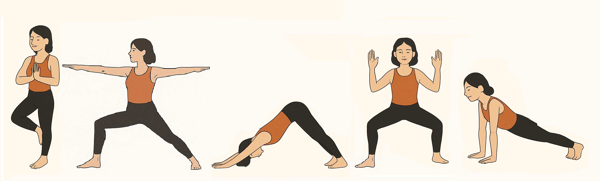

# Yoga Pose Classifier & Feedback System

## Overview

This project is a real-time yoga pose classification and feedback system built using a Convolutional Neural Network (CNN) and MediaPipe pose estimation. It captures video from a webcam, classifies the yoga pose performed, and provides actionable feedback to help users improve their posture.

---

## Features

- **Real-time pose classification:** Uses a CNN model trained on yoga pose images to identify common poses.
- **MediaPipe pose detection:** Extracts body landmarks to analyze joint angles and posture.
- **Personalized feedback:** Offers specific tips to correct and improve yoga poses based on landmark analysis.
- **Live webcam interface:** Visualizes pose classification and feedback overlayed on the video stream.

---

## Getting Started


### Prerequisites

- Python 3.7+
- TensorFlow
- MediaPipe
- OpenCV
- NumPy

Install dependencies with:

```bash
